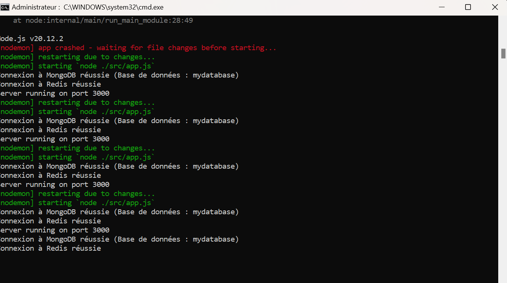

# Projet de fin de module NoSQL
# Réalisé par Salma FENNAN

# Description
Ce projet a pour objectif de créer une API backend pour une plateforme d'apprentissage en ligne en utilisant une base de données NoSQL. L'API permet de gérer des cours, les etudiants.
L'accent est mis sur une organisation professionnelle du code, l'utilisation de bonnes pratiques et la gestion des données avec MongoDB et Redis.

* Fonctionnalités principales :
- Gestion des cours (CRUD).
- Utilisation d'une base de données MongoDB pour le stockage principal.
- Implémentation de Redis pour le caching ou d'autres besoins spécifiques.
- Gestion d'erreurs et documentation du code.


# Installation
1. Clonez le dépôt.
2. Exécutez npm install.
3. Configurez le fichier .env.
4. Lancez le serveur avec npm start.

# Mon Installation de MongoDB 


# Installation de Redis
Pour installer Redis, vous pouvez suivre les étapes decrit en bas ou suivre le lien suivant en fonction de votre système d'exploitation :[lien d'installation redis](https://redis.io/docs/latest/operate/oss_and_stack/install/install-redis/install-redis-on-windows/)

# Sous Linux (Ubuntu)
```bash
sudo apt update
sudo apt install redis-server
sudo systemctl enable redis-server
sudo systemctl start redis-server
```

# Sous macOS
Si vous utilisez Homebrew, vous pouvez installer Redis avec la commande suivante :
```bash
brew install redis
```
# Mon installation de redis :


**Configurer les variables d'environnement** :
   Dans le fichier `.env`, assurez-vous de configurer les informations de connexion à MongoDB et Redis :

   ```
   MONGODB_URI=mongodb://localhost:27017/plateforme-apprentissage
   REDIS_HOST=localhost
   REDIS_PORT=6379
   ```

**Lancer l'application Backend** :
   Pour démarrer l'application, exécutez :

   ```bash
   npm start
   ```

# Structure du Projet

Voici la structure du projet pour vous aider à comprendre comment le projet est organisé :

```
LEARNING-PLATFORM-NODEJS/
├── imgages/                      # Dossier pour les captures d'ecrans utilisé dans le readme.md
├── node_modules/                 # Modules Node.js installés
├── src/                          # Dossier principal du code source
│   ├── config/                   # Configuration de la base de données et environnement
│   │   ├── db.js                 # Configuration et connexion à la base de données MongoDB
│   │   └── env.js                # Variables d'environnement
│   ├── controllers/              # Dossier des contrôleurs
│   │   ├── courseController.js   # Logique métier pour les cours
│   │   ├── enrollmentController.js # Logique métier pour les inscriptions
│   │   └── studentController.js  # Logique métier pour les étudiants
│   ├── routes/                   # Dossier des routes API
│   │   ├── courseRoutes.js       # Routes pour les cours
│   │   ├── enrollmentRoutes.js   # Routes pour les inscriptions des etudiants dans les cours
│   │   └── studentRoutes.js      # Routes pour les étudiants
│   ├── services/                 # Dossier des services
│   │   ├── mongoService.js       # Services liés à la base de données MongoDB
│   │   └── redisService.js       # Services liés à Redis
├── app.js                        # Point d'entrée principal de l'application
├── .env                          # Variables d'environnement
├── .gitignore                    # Fichiers à ignorer par Git
├── package.json                  # Fichier de configuration npm pour les dépendances
├── package-lock.json             # Fichier de verrouillage des dépendances npm
└── README.md                     # Documentation du projet
```

# Réponses aux questions:

# Configuration des variables d'environnement fichier `.env`

 Pourquoi utiliser des variables d'environnement ?
Les variables d'environnement permettent de gérer de manière sécurisée et flexible des informations sensibles et des configurations spécifiques à chaque environnement (développement, test, production). Elles offrent plusieurs avantages :

Sécurité : Elles empêchent l'exposition des informations sensibles dans le code source.
Flexibilité : Elles permettent d'adapter les configurations sans modifier le code source.
Portabilité : Elles facilitent le déploiement sur différents serveurs avec des configurations spécifiques.
Clarté : Elles centralisent les configurations, simplifiant ainsi leur gestion.

# Quelles informations sensibles ne jamais commiter ?
Il est crucial de ne pas inclure dans le dépôt Git les éléments suivants :
-URI ou URL des bases de données (ex. : MONGODB_URI, REDIS_URI).
-Clés d’API ou identifiants de services tiers.
-Secrets ou clés privées pour des services comme JWT.
-Ports ou configurations spécifiques à l'environnement.

# Fichier `.gitignore`
Pourquoi utiliser un fichier `.gitignore` ?
Pourquoi utiliser un fichier .gitignore ?
Le fichier .gitignore exclut certains fichiers ou dossiers du suivi de version. Cela garantit que des fichiers sensibles ou inutiles au bon fonctionnement de l'application ne soient pas inclus dans le dépôt Git.
Contenu du fichier .gitignore
Voici le contenu du fichier .gitignore utilisé dans ce projet : node_modules/ et .env.

# Gestion des connexions aux bases de données `config/db.js`
 Un module séparé permet de centraliser la gestion des connexions, simplifiant le code et rendant l'application plus modulaire. Il facilite aussi la gestion des erreurs, des tentatives de reconnexion, et assure une structure propre et réutilisable.

# Comment gérer proprement la fermeture des connexions ?
Nous utilisons la fonction closeConnections() pour fermer les connexions MongoDB et Redis lors de l'arrêt de l'application. Cela garantit une fermeture correcte des connexions, prévenant les fuites de ressources et assurant la stabilité de l'application.

# Fichier : `env.js`

Le fichier 'env.js' charge et valide les variables d'environnement nécessaires pour que l'application fonctionne correctement. Ce fichier est crucial pour assurer la sécurité et la configuration de l'application, en validant les variables avant de démarrer le serveur.

# Pourquoi est-il important de valider les variables d'environnement au démarrage ?
Valider les variables d'environnement au démarrage assure que toutes les configurations nécessaires, telles que les informations de connexion à la base de données et aux services externes, sont présentes. En cas de variable manquante, une erreur explicite empêche le démarrage de l'application, ce qui permet de résoudre les problèmes de configuration avant l'exécution.

# Que se passe-t-il si une variable requise est manquante ?
Si une variable requise est absente, le programme lance une erreur explicite, empêchant ainsi le démarrage de l'application et signalant immédiatement un problème de configuration.

# Fichier :'app.js'

# Comment organiser le point d'entrée de l'application ?
Le fichier app.js est responsable de la création du serveur Express, de la gestion des middlewares, de la connexion aux bases de données, et du démarrage du serveur. Il centralise également les routes et la gestion des erreurs, garantissant une configuration cohérente du serveur.

# Quelle est la meilleure façon de gérer le démarrage de l'application ?
 Le démarrage de l'application est géré par la fonction startServer(). Elle se charge de :
Connecter aux bases de données via connectDatabases().
Configurer les routes.
Démarrer le serveur Express une fois les étapes de préparation terminées.
Cela assure que l'application ne démarre que lorsque toutes les connexions et configurations sont prêtes.

# Capture d'ecran montrant que la connection à la base de données mongdb et redis



# Fichier : `courseController.js`

# Question : Quelle est la différence entre un contrôleur et une route ?
- Route : Définit l'URL d'une ressource et la méthode HTTP à utiliser pour interagir avec cette ressource. Elle écoute les requêtes envoyées par le client.
- Contrôleur : Contient la logique métier nécessaire pour répondre aux requêtes des routes. Il interagit avec la base de données et renvoie une réponse appropriée au client.

# Question : Pourquoi séparer la logique métier des routes ?
Séparer la logique métier des routes rend l'architecture plus propre et modulaire. Cela améliore la lisibilité, la réutilisabilité, la testabilité et la maintenance, en permettant de modifier la logique métier sans toucher aux routes.

# Fichier : `courseRoutes.js`

# Pourquoi séparer les routes dans différents fichiers ?
Séparer les routes en fichiers distincts permet de maintenir une structure de code claire et modulaire. Chaque fichier peut gérer un ensemble logique de routes, facilitant la lecture et la maintenance du code.

# Comment organiser les routes de manière cohérente ?
Les routes doivent être organisées par ressources. Par exemple, toutes les routes relatives aux cours sont groupées dans courseRoutes.js. Il est aussi important de suivre une convention de nommage des URL pour garantir une organisation uniforme.

# Fichier : `mongoServices.js`

# Pourquoi créer des services séparés ?
Les services permettent d'organiser la logique métier et les interactions avec la base de données de manière cohérente et modulaire. Cela facilite la maintenance, les tests unitaires et le réemploi du code.

# Question : Comment gérer efficacement le cache avec Redis ?
Pour une gestion optimale du cache avec Redis :
Définir un TTL (Time-To-Live) adapté.
Éviter d'y stocker des données volumineuses peu demandées.
Utiliser un mécanisme d'invalidation du cache lorsque les données changent.
Surveiller l'utilisation de Redis pour éviter la saturation mémoire.
 
# Question: Quelles sont les bonnes pratiques pour les clés Redis ?
- Utiliser des noms de clés clairs et structurés, tels que app:module:resource:id.
- Éviter les noms génériques comme data ou cache.
- Grouper les clés avec des préfixes pour une gestion et un nettoyage facilités.
- Toujours définir un TTL pour éviter l'accumulation de clés obsolètes.

# Étapes d'Installation et de Lancement :

1. Installation des Dépendances :
Avant de démarrer l'application, exécutez la commande npm install pour installer toutes les dépendances nécessaires.

2. Configuration de la Base de Données :
L'application utilise une base de données MongoDB appelée mydatabase. Assurez-vous que votre instance MongoDB est active et correctement configurée.

3. Lancer le Serveur :
Démarrez le serveur Express en exécutant la commande 'npm start'. Le serveur commencera à écouter sur le port configuré. Vous verrez un message dans le terminal confirmant son bon fonctionnement.


# Exécution d'API avec Node.js

# Voici les captures d'ecran pour les fonctionnalites tester pour la gestion des cours, des étudiants et les inscriptions des etudiants à des cours :

1. **Gestion des Cours** : Offre la possibilité de créer et d'administrer les cours destinés aux étudiants.


2. **Gestion des Étudiants** : Ajouter, consulter et administrer les informations des étudiants.


3. **Gestion des Inscriptions** : Facilite l'enregistrement des étudiants aux différents cours.


# Usage des Vues
Ces vues sont particulièrement utiles pour :

1. Inspection et validation des données : Vérifier la cohérence et l'intégrité des informations stockées.
2. Exécution de requêtes avancées : Interroger ou manipuler les données selon des besoins spécifiques.
3. Analyse statistique : Identifier des tendances, comme le nombre d'inscriptions par cours ou les catégories les plus populaires.

### Conclusion

Ce projet offre une opportunité idéale pour tester les fonctionnalités essentielles d'une plateforme d'apprentissage en ligne. En intégrant une gestion dynamique des étudiants, des inscriptions et des cours, ainsi que l'affichage de statistiques détaillées optimisé par Redis pour la mise en cache, ce système constitue une base solide pour développer une plateforme d'apprentissage complète et évolutive.
